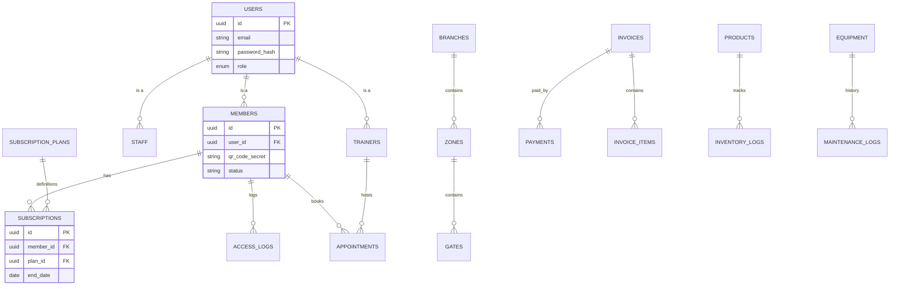
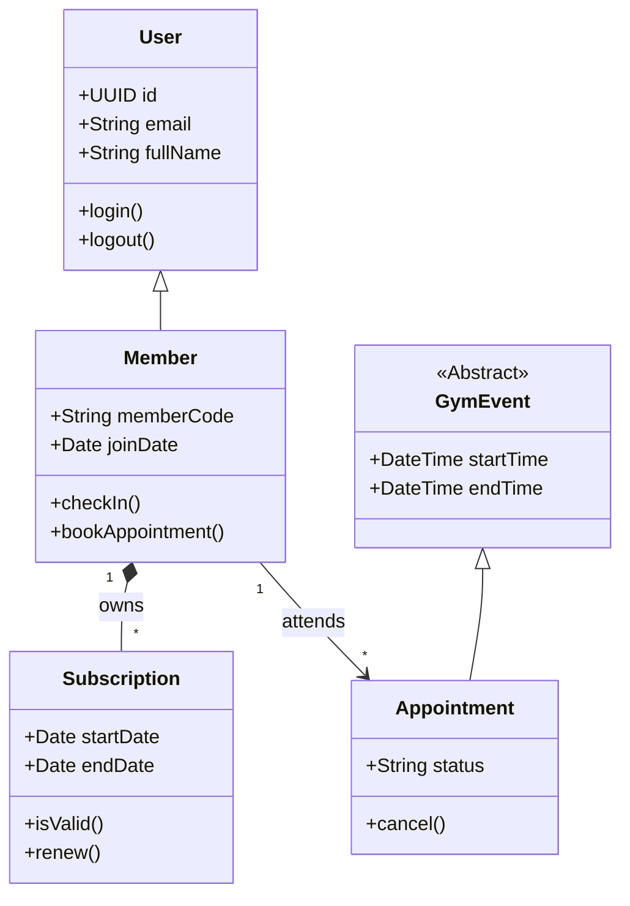
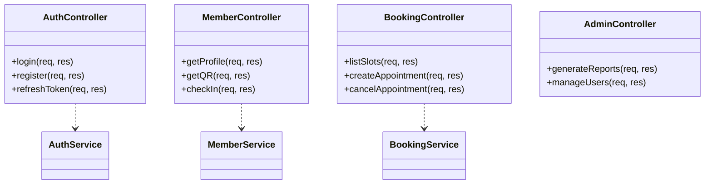
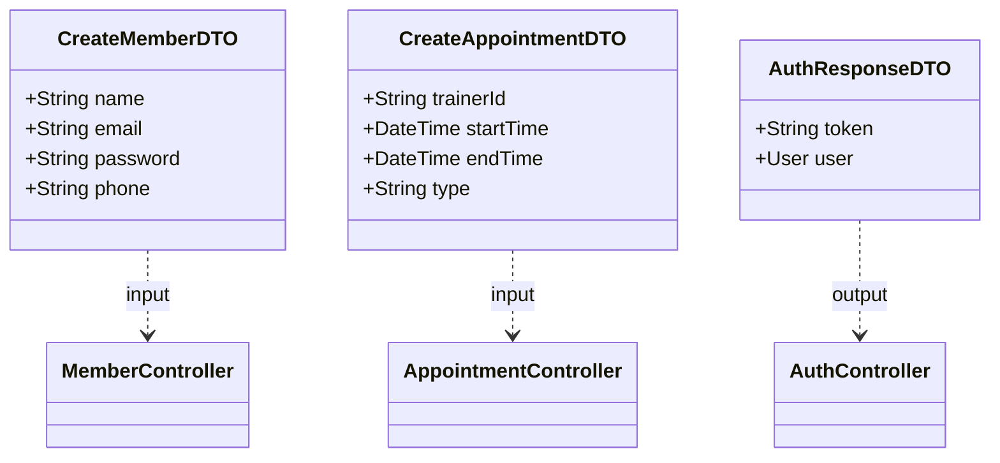

# Power World Gym System - Database Documentation

This document provides a comprehensive technical overview of the database design, including diagrams and data dictionaries as per the requirements.

## 1. Entity-Relationship Diagram (ERD)

## 2. Class Diagrams

### 2.1 Entity Classes (Domain Layer)
Represents the core business objects.

### 2.2 Controller Classes (API Layer)
Handles HTTP requests and business logic references.

### 2.3 Interface Classes (DTOs)
Data Transfer Objects used for API communication.

## 3. Data Dictionary

### 3.1 `users` Table
| Column | Type | Constraints | Description |
|---|---|---|---|
| `id` | VARCHAR(36) | PK, UUID | Unique identifier |
| `email` | VARCHAR(255) | UNIQUE, NOT NULL | User login email |
| `password_hash` | VARCHAR(255) | NOT NULL | Bcrypt hashed password |
| `role` | ENUM | NOT NULL | 'admin', 'manager', 'staff', 'trainer', 'member' |
| `full_name` | VARCHAR(100) | NOT NULL | Legal name |

### 3.2 `members` Table
| Column | Type | Constraints | Description |
|---|---|---|---|
| `id` | VARCHAR(36) | PK | Links to Users |
| `member_code` | VARCHAR(20) | UNIQUE | Display ID (e.g. MEM001) |
| `qr_code_secret` | TEXT | | Secret key for dynamic TOTP QR generation (NFR-01) |
| `home_branch_id` | VARCHAR(36) | FK | Primary gym location |

### 3.3 `appointments` Table (New)
| Column | Type | Constraints | Description |
|---|---|---|---|
| `id` | VARCHAR(36) | PK | Unique ID |
| `member_id` | VARCHAR(36) | FK | The member booking |
| `trainer_id` | VARCHAR(36) | FK | The trainer hosting |
| `start_time` | DATETIME | NOT NULL | Session start |
| `status` | ENUM | Default: 'pending' | 'confirmed', 'cancelled', 'completed' |

### 3.4 `products` Table (New)
| Column | Type | Constraints | Description |
|---|---|---|---|
| `id` | VARCHAR(36) | PK | Unique ID |
| `sku` | VARCHAR(50) | UNIQUE | Stock Keeping Unit |
| `price` | DECIMAL(10,2)| NOT NULL | Selling price LKR |
| `stock_quantity`| INT | Default: 0 | Current inventory level |

## 4. Relational Data Model (Normalization)

The database is designed in **Third Normal Form (3NF)** to ensure data integrity and reduce redundancy.

1.  **1NF (Atomicity)**: All columns contain atomic values. No repeating groups (e.g., `permissions` are in a separate `role_permissions` table, not a comm-separated string).
    *   *Implementation*: Subscriptions are separate rows, not a list in `members`.
2.  **2NF (Partial Dependencies)**: All non-key attributes depend on the full primary key.
    *   *Implementation*: `invoice_items` link to `invoices` via FK, and product details live in `products`, not repeated in the item row.
3.  **3NF (Transitive Dependencies)**: Non-key attributes depend *only* on the primary key.
    *   *Implementation*: `branch_name` is in `branches`, referenced by `branch_id` in `staff`, rather than storing `branch_name` directly in `staff`.

## 5. Security & Validation (NFRs)

*   **QR Security (NFR-01)**: `qr_code_secret` stores a base32 secret. The mobile app generates a time-based code (TOTP). The backend validates this code + user ID to prevent replay attacks.
*   **Encryption (NFR-03)**:
    *   Passwords: `users.password_hash` (Bcrypt).
    *   Sensitive PII: Transmitted over HTTPS.
*   **Audit Logging**: `audit_logs` table captures critical write operations for compliance.
